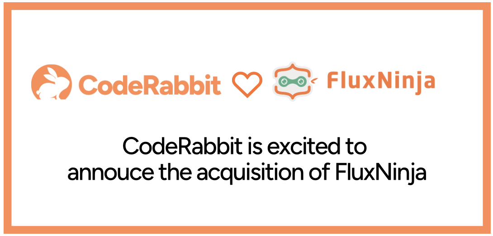

We are excited to announce that CodeRabbit has acquired FluxNinja, a startup
that provides a platform for building scalable generative AI applications. This
acquisition will allow us to ship new use cases at an industrial scale while
sustaining our rapidly growing user base. FluxNinja's Aperture product provides
advanced rate-limiting, caching, and request prioritization capabilities for
building reliable and cost-effective AI workflows.

<!--truncate-->

Since our launch, Aperture's open-source core engine has been critical to our
infrastructure. Our initial use case centered around mitigating aggressive rate
limits imposed by OpenAI, allowing us to prioritize paid and real-time chat
users during peak load hours while queuing requests from the free users.
Further, we used Aperture's caching and rate-limiting capabilities to offer
open-source developers a fully featured free tier while minimizing abuse. These
capabilities allowed us to scale our user base without ever putting up a
waitlist and at a price point that is sustainable for us. With Aperture's help,
CodeRabbit has scaled to over 100K repositories and several thousand
organizations under its review in a short period.

We started CodeRabbit with a vision to build an AI-first developer tooling
company from the ground up. Building enterprise-ready applied AI tech is unlike
any other software engineering challenge of the past. Based on our learnings
while building complex workflows, it became apparent that we need to invest in a
platform that can solve the following problems:

- Prompt server: Prompt design and runtime rendering is akin to responsive web
  design, in which a page has to be rendered differently based on the screen
  size and other parameters. We need a platform that can render prompts based on
  the context windows of underlying models and prioritize the context packing
  based on business attributes. For instance, it's impossible to include the
  entire repository and past conversations in a single prompt for code review.
  Even if it were possible, LLM models exhibit poor recall when doing an
  inference on a large context window. While it may be acceptable for use cases
  like chat, it’s not for use cases like code reviews that require accurate and
  precise outputs.

- Observability into LLM outputs: One key challenge with prompting is that it's
  inherently non-deterministic. The same prompt can result in vastly different
  outputs, which can be frustrating, but this is precisely what makes AI systems
  powerful in the first place. Even slight variations in the prompt can result
  in vastly inferior or noisy outputs, leading to a decline in user conversion.
  At the same time, the underlying AI models are ever-evolving, and the same
  prompts drift over time as the models get regular updates. Traditional
  observability is of little use here, and we need to rethink how we classify
  and track different outputs and their quality. Again, this is a problem that
  we have to solve in-house.

- Guardrails: Since we provide a free service to public repositories, we must
  ensure that our product is not misused beyond its intended purpose or tricked
  into divulging sensitive information, which could include our base prompts.

While FluxNinja's Aperture project was limited to solving a different problem
around load management and reliability, we found that the underlying technology
and the team's expertise were a perfect foundation for building the AI platform.
Prompt engineering is in its nascent stage but is emerging as a joystick for
controlling AI behavior. Packing the context window with relevant documents
(retrieval augmented generation, aka RAG) is also emerging as the preferred way
of providing proprietary data compared to fine-tuning the model. Most AI labs
focus on increasing the context window rather than making fine-tuning easier or
cheaper. Despite the emergence of these clear trends, applied AI systems are
still in their infancy. None of the recent AI vendors are building the "right"
platform, as most of their focus has been on background/durable execution
platforms, model routing proxies/gateways, chaining RAG pipelines using reusable
components, and so on. Most of these approaches fall short of what a real-world
AI workflow requires. The right abstractions and best practices will still have
to appear, and the practitioners themselves will have to build them. Creating
the “right” AI platform will be a differentiator for AI-first companies, and we
are excited to tackle this problem head-on with a systems engineering mindset.

We are excited to have the FluxNinja team on board and to bring our users the
best-in-class AI workflows. We are also happy to welcome Harjot Gill, the
founder of FluxNinja, and the rest of the team to CodeRabbit.
