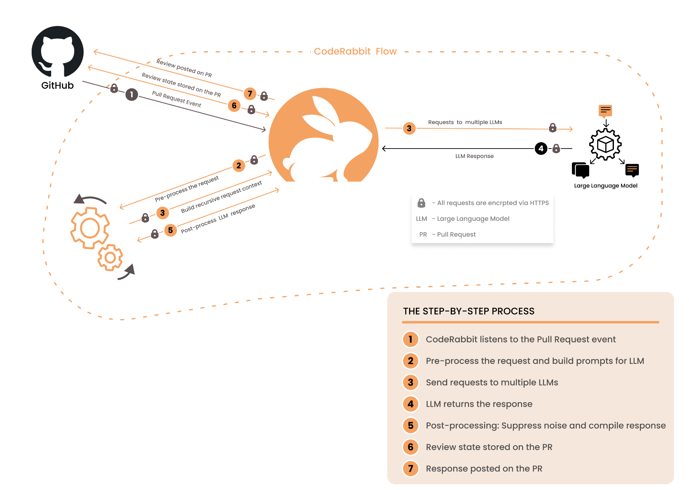

<head>
 <meta charSet="utf-8" />
  <meta name="title" content="CodeRabbit: AI-powered Code Reviews" />
  <meta name="description" content="Accelerate Code Reviews with AI" />

  <meta property="og:type" content="website" />
  <meta property="og:url" content="https://coderabbit.ai/" />
  <meta property="og:title" content="CodeRabbit: AI-powered Code Reviews" />
  <meta property="og:description" content="Accelerate Code Reviews with AI" />
  <meta property="og:image" content="/preview_meta.jpg" />

  <meta name="twitter:image" content="https://coderabbit.ai/preview_meta.jpg" />
  <meta name="twitter:card" content="summary_large_image" />
  <meta name="twitter:title" content="CodeRabbit: AI-powered Code Reviews" />
  <meta name="twitter:description" content="Accelerate Code Reviews with AI." />
</head>

**CodeRabbit** is an innovative, AI-first code reviewer. It provides context aware review feedback on a pull request within minutes, thereby significantly reducing the time and effort associated with manual code reviews. Secondly, it brings a different perspective to the reviews and finds issues often missed by the human eye. Developers can chat with the bot within the code, which allows them to provide additional context, ask questions, or have the bot generate code. It learns from your suggestions and gets better overtime.

**CodeRabbit** seamlessly integrates with GitHub and GitLab repositories, performing continuous, incremental reviews for each commit within a pull request. Review feedback is sent back to the pull requests and can be directly committed.

### How does CodeRabbit work?

**CodeRabbit** integrates into code repositories using GitHub or GitLab webhooks and monitors events related to Pull Request (PR) and Merge Request (MR) changes. A comprehensive review is performed when a PR or MR is created, and for incremental commits and comments addressed to the bot. The feedback is then sent directly back to the PR or MR.

### Data, Privacy, and Security.

**CodeRabbit** does not use data collected during code reviews to train or influence the models. Queries to the Large Language Model (LLM) are ephemeral. Neither we nor the LLM we use share any data collected during the code review process with other third parties.

Does CodeRabbit store my Data? We store embeddings of your conversations, which are used to improve future reviews.

Compliance and Data Privacy: Your data is kept confidential, isolated, and used only to improve your reviews. Data storage complies with SOC2 Type II, GDPR, and HIPAA standards.

Opting Out: You can choose to opt out of data storage at any time. Opting out won't affect your access but will limit the personalization of the reviews.

### Do you need CodeRabbit with the AI code generators or co-pilot?

Code reviews remain essential, whether the code is written by a human or a bot. This is mainly because the perspective of the reviewer differs from that of the code generator, whether human or machine. This distinction is precisely why human peer reviews have been effective for so long. While AI-powered code-generation tools hold immense potential, it's important to recognize that these generators are still in their early stages and may not be equipped to auto-generate meaningful code for moderately complex applications.

### How is CodeRabbit different from existing code review tools?

Existing code review tools are good at linting and static code analysis; however, they lack context-aware, human-like review feedback.

For information on how to get started with **CodeRabbit**, please visit the [Get Started page](https://coderabbit.ai/docs/get-started/signup).
