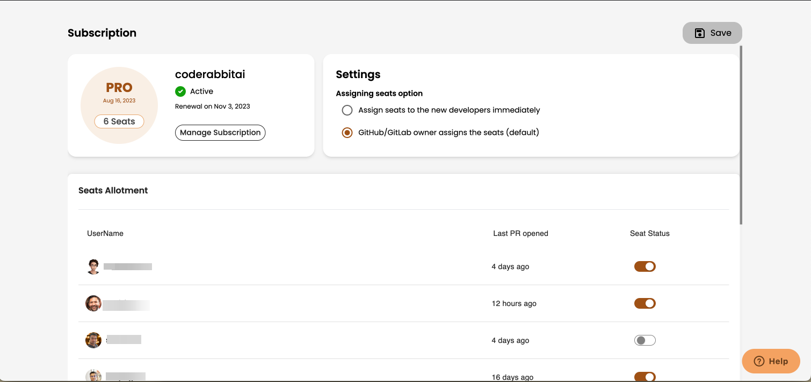
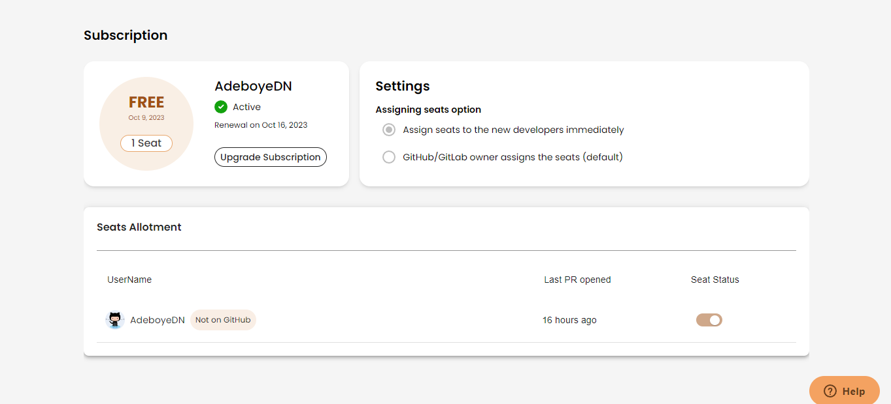

<head>
 <meta charSet="utf-8" />
  <meta name="title" content="CodeRabbit: AI-powered Code Reviews" />
  <meta name="description" content="Accelerate Code Reviews with AI" />

  <meta property="og:type" content="website" />
  <meta property="og:url" content="https://coderabbit.ai/" />
  <meta property="og:title" content="CodeRabbit: AI-powered Code Reviews" />
  <meta property="og:description" content="Accelerate Code Reviews with AI" />
  <meta property="og:image" content="/preview_meta.jpg" />

  <meta name="twitter:image" content="https://coderabbit.ai/preview_meta.jpg" />
  <meta name="twitter:card" content="summary_large_image" />
  <meta name="twitter:title" content="CodeRabbit: AI-powered Code Reviews" />
  <meta name="twitter:description" content="Accelerate Code Reviews with AI" />
</head>

This section covers the plans, pricing, and subscription management of CodeRabbit.

### **Understanding Your Options**

-   **Transparent Pricing**: CodeRabbit offers a per-seat pricing model that scales with your team size, ensuring you pay for what you need.
-   **7-Day Free Trial**: All plans start with a generous 7-day free trial for CodeRabbit Pro for the entire organization, ensuring a commitment-free experience
-   **No Credit Card Required**: You won't need a credit card to start your free trial.
-   **CodeRabbit Seats**
    Every developer who submits a pull request is counted as a separate seat. Seats can be purchased for all or for a limited number of developers.

### 1. Pro Plan

### Features:

-   This plan begins with a 7-day free trial, with no credit card required.
-   Summarization of pull requests.
-   Includes line-by-line reviews of all changes in the Pull Request
-   Ability to have conversations with CodeRabbit bot.
-   Reviews on unlimited public and private repositories within the organization.

### Pricing:

-   Monthly: $15 per month.
-   Annual: $12 per month billed annually, with a 20% discount.

### Billing:

-   Billed per participating developer.

### Usage Limits:

These are the hourly usage limits for each developer per repository:

-   Number of files reviewed per hour: 100 Files
-   Number of reviews per hour (includes incremental reviews): 9
-   Number of conversations per hour: 50

### 2. Free Plan

### Features:

-   Starts with a 7-day free trial of the Pro plan.
-   unlimited access on both public and private repositories.
-   Summarization pull requests on private repositories.
-   Reviews pull requests on public repositories.

### Pricing:

-   $0 per month.

### Billing:

-   Free forever, no credit card required.

### **Subscription Management**

### 1. Pro Plan

-   GitHub/GitLab organization owners can purchase or make changes to the subscription.
-   You can choose to manually purchase seats and assign them to developers, or have them assigned automatically as developers create pull requests.
-   During the trial period, seat assignment is automatic, but the number of seats can be adjusted when purchasing the subscription.

### 2. Free Plan

-   Seats are assigned to new developers immediately

