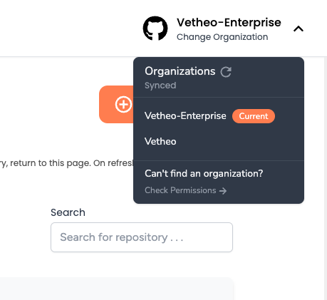
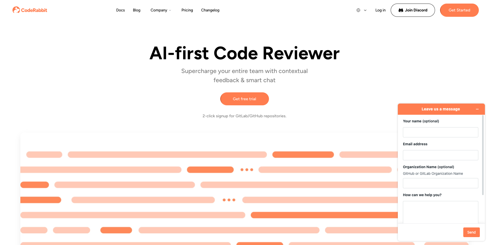

<head>
 <meta charSet="utf-8" />
  <meta name="title" content="CodeRabbit: AI-powered Code Reviews" />
  <meta name="description" content="Accelerate Code Reviews with AI" />

{" "}

<meta property="og:type" content="website" />
<meta property="og:url" content="https://coderabbit.ai/" />
<meta property="og:title" content="CodeRabbit: AI-powered Code Reviews" />
<meta property="og:description" content="Accelerate Code Reviews with AI" />
<meta property="og:image" content="/preview_meta.jpg" />

  <meta name="twitter:image" content="https://coderabbit.ai/preview_meta.jpg" />
  <meta name="twitter:card" content="summary_large_image" />
  <meta name="twitter:title" content="CodeRabbit: AI-powered Code Reviews" />
  <meta name="twitter:description" content="Accelerate Code Reviews with AI" />
</head>

Welcome to CodeRabbit's Support! Please refer this section if you encounter any issues or have questions. Our support team will respond back as soon as possible.

### **Common Issues and Answers**

These are the most common questions our support team receives, and you might find an answer here

### Can I switch between different organizations on CodeRabbit?

Yes, you can switch between different organizations on CodeRabbit. To do so, click on the organization name in the top right corner of the CodeRabbit UI.

### Can CodeRabbit subscription be used across multiple organizations?

Subscription seat are tied to the specific GitHub/GitLab organization under which they are purchased and cannot be used under another organization.

### Can CodeRabbit review my existing PRs after integrating it?

CodeRabbit would by default only review new PRs or existing PRs which have a new commits after the app is installed.
You can however use @coderabbitai review command on the PR to trigger a review of existing PRs.

### Who can add the repositories on CodeRabbit?

You need to be GitHub/GitLab admin to add the repositories.

### Do I need own OpenAI key with CodeRabbit Pro?

OpenAI cost is part of the subscription.There is no additional cost for OpenAI.

### What is the difference between CodeRabbit OSS ai-pr-reviewer and CodeRabbit Pro ?

ai-pr-reviewer is our Open Source Software (OSS) for pull request reviews. With CodeRabbit OSS, you need your own OpenAI key, and you will incur OpenAI costs.
On the other hand, with a CodeRabbit Pro subscription, the OpenAI cost is included. Additionally, CodeRabbit Pro offers advanced prompts and superior noise reduction features, which are not present in CodeRabbit OSS.

### Can I use both CodeRabbit OSS and CodeRabbit Pro together ?

You can, but this will result in duplicate reviews. We suggest you use only one of the two.

### **Opening a Support Ticket**

To get assistance from our support team, open a ticket using the help icon on the CodeRabbit UI:

Complete the support ticket by providing your name, email, a description of your issue, and attaching any necessary files. If you are reporting a bug , please provide the GitHub or GitLab organization name.

### Explore More

To see more common issues faced by CodeRabbit users, visit our FAQ section for detailed answers and solutions to frequently encountered problems.

### **Community Collaboration**

Consider joining the CodeRabbit community on Discord.
