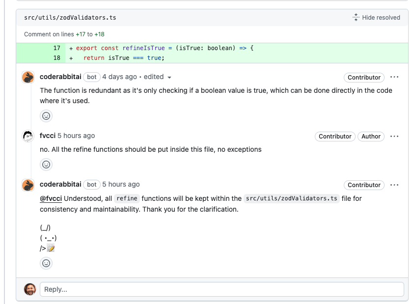
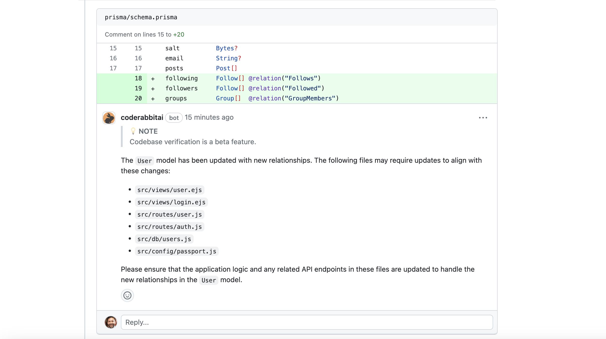
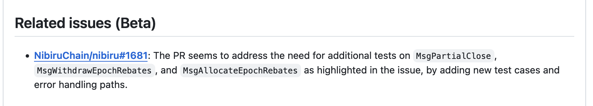
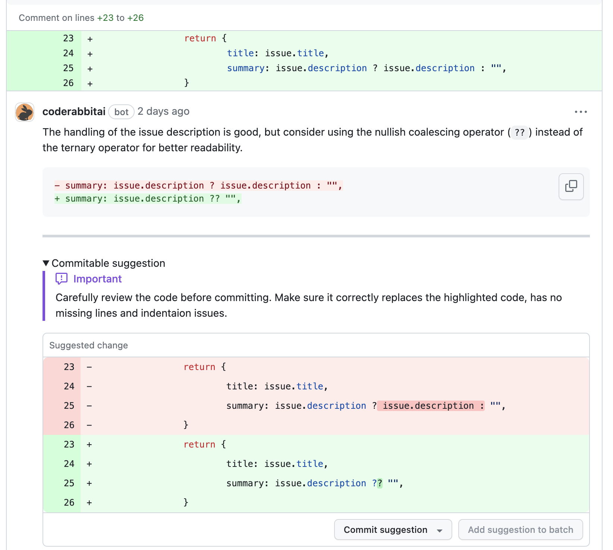
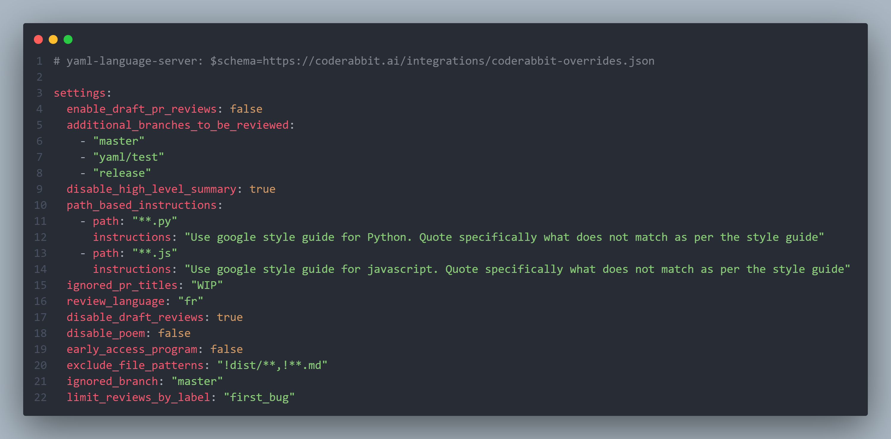
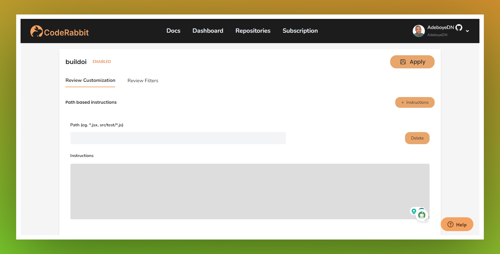

<head>
 <meta charSet="utf-8" />
  <meta name="title" content="CodeRabbit: AI-powered Code Reviews" />
  <meta name="description" content="Accelerate Code Reviews with AI" />

  <meta property="og:type" content="website" />
  <meta property="og:url" content="https://coderabbit.ai/" />
  <meta property="og:title" content="CodeRabbit: AI-powered Code Reviews" />
  <meta property="og:description" content="Accelerate Code Reviews with AI" />
  <meta property="og:image" content="/preview_meta.jpg" />

  <meta name="twitter:image" content="https://coderabbit.ai/preview_meta.jpg" />
  <meta name="twitter:card" content="summary_large_image" />
  <meta name="twitter:title" content="CodeRabbit: AI-powered Code Reviews" />
  <meta name="twitter:description" content="Accelerate Code Reviews with AI" />
</head>

Learn about the latest updates and bug fixes in CodeRabbit.

Product Updates 

## Request Changes Workflow 

**Date: December 18, 2023**

Enable Request Changes review workflow for CodeRabbit reviews via `.coderabbit.yaml` 
Yaml field `request_changes_workflow`  (default: `false`). When enabled, review comments are posted as request changes and CodeRabbit review will be marked approved once all the review comments are resolved. 

## Learnings 

**Date: December 5, 2023**

CodeRabbit can now learn from your conversations to fine-tune your reviews. If you encounter inaccurate feedback or something not relevant to your codebase, just let the bot know, and it will remember the context for the future. We understand that coding practices and standards evolve over time. Using the chat, you can inform the bot, and it will remove any existing learnings that are no longer relevant. This feature does not work, if you have opted out of data storage.

## Codebase Verification

**Date: December 5, 2023**

Verifies the reference of the changes on the overall codebase and identifies missing changes. 

##  Jira and Linear Integrations

**Date: December 5, 2023**

 You can now integrate Jira and Linear into CodeRabbit. This would be used for additional context while reviewing pull requests. If you use any of these systems, we recommend you integrate CodeRabbit. We will be adding more integrations over time.

## Related Issues

**Date: December 5, 2023**

Identifies all issues affected by the code changes. This helps understand the impact on the overall product. It also assists in identifying duplicate issues or the impact on any other existing issues. This feature does not work, if you have opted out of data.

## Issue Validation

**Date: November 5, 2023**

- **Issue Validation**:
  - CodeRabbit review can now assess the pull request changes against the linked GitHub or GitLab issue. Integration with other workflow systems including Jira and Linear is under development. 

## Committable suggestions

**Date: November 1, 2023**

- **Code review comments**:
  - Review comments can now post committable suggestions that can be committed within the pull request with a single click.

## Resolve Command

**Date: October 28, 2023**

- **Resolve Command**:
  - Use `@coderabbitai resolve` to mark all the CodeRabbit review comments as resolved all at once.

## CodeRabbit Commands

**Date: October 23, 2023**

Introducing additional CodeRabbit commands for managing code reviews.

- **Pause Reviews**: 
  - Use `@coderabbitai pause` in a PR comment to halt ongoing reviews.
- **Resume Reviews**: 
  - Enter `@coderabbitai resume` in a PR comment to continue paused reviews.
- **On-Demand Reviews**: 
  - Disable automatic reviews for your repository to switch to on-demand reviews.
  - Use `@coderabbitai review` in a PR comment. This command will override all review filters that might be set up in the repository settings and will initiate a one-time review.  
- **Help Command**:
  - You can at any time post `@coderabbitai help` in a PR comment to get the list of all valid commands.

## Customization CodeRabbit with YML File

**Date: October 12, 2023**

CodeRabbit customizations made easy!
You can now customize CodeRabbit using a YML file from your repository. To learn more, refer to our comprehensive [documentation on customizing CodeRabbit](https://coderabbit.ai/docs/get-started/customize-coderabbit).

## Path-Based Review Instructions in CodeRabbit

**Date: September 21, 2023**

Introducing  Path-Based Instructions  CodeRabbit reviews now allow setting path-based instructions. This feature is particularly useful if you want reviewers to follow specific guidelines. For example, if you have a mono repo, this enables the setting of custom instructions by directories. It can also be used to set instructions for specific file types. For instance: */.js - ensure that the code adheres to the Google style guide.

[Learn More](https://coderabbit.ai/docs/get-started/prompt-customization)

## Introducing CodeRabbit for GitLab Integration

**Date: September 19, 2023**

CodeRabbit is now available for GitLab! We know many of you have been waiting for this integration. Thank you for your patience. Sign up for the free trial!