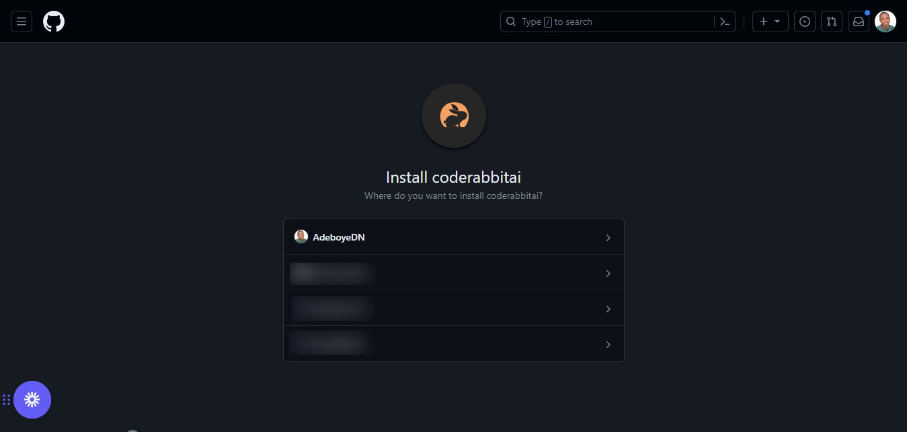
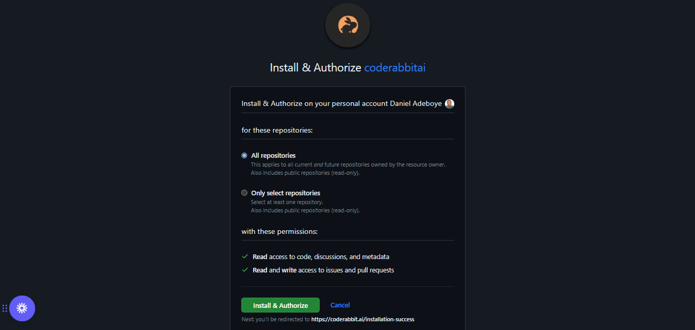

### **Sign Up for CodeRabbit**

Signing up for CodeRabbit is quick and easy, allowing you to get started in just
a few seconds. Whether you're an individual developer or part of a team, you can
start for free and upgrade to a paid plan after a no-commitment trial. For more
information about CodeRabbit's subscription plan options, please refer to the
pricing page.

### **Step 1: Getting Started**

**Login with GitHub or GitLab**: Log in with your GitHub or GitLab account at
[https://coderabbit.ai/login](https://coderabbit.ai/login)

### **Step 2: Select Organization**

On the GitHub page, you will be prompted to choose the organization where you
want to install the CodeRabbit app. Select the organization to proceed.

### **Step 3: Authorize CodeRabbit**

After selecting the organization, you will be directed to a GitHub repositories
page where you will install and authorize the CodeRabbit GitHub app. You can
choose to grant access to all your organization's repositories or select
specific repositories.

After you have installed the CodeRabbit app, the reviews will start
automatically with the new pull requests or incremental commits to existing pull
requests. To trigger reviews on existing pull requests, post "@coderabbitai
review" as a comment on the pull request.

:::tip The automatic code review behavior can be changed to "On-Demand". To make
this change, go to the repository settings in the UI or modify the appropriate
setting in the YAML file to disable reviews. :::

### **Need help?**

If you require assistance, our support team is here to help. Simply click on the
help icon within the CodeRabbit user interface. For more detailed information,
please refer to the "Support" section. Additionally, consider joining the
CodeRabbit Discord community to connect with other users and access a wealth of
knowledge about using CodeRabbit effectively.
