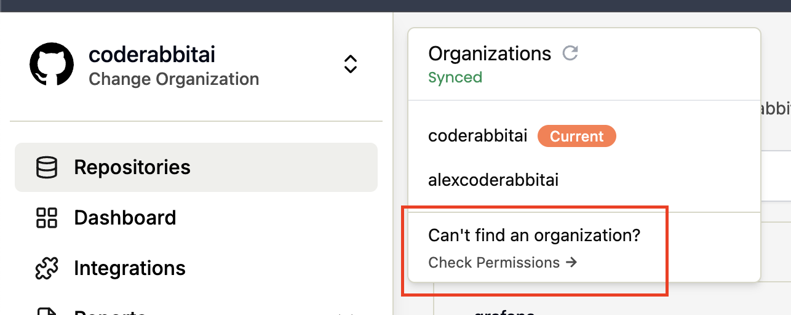
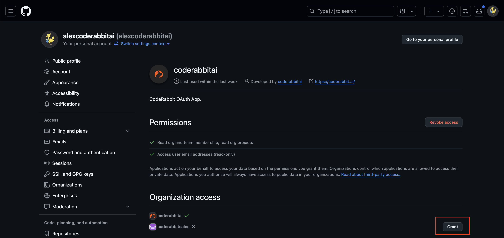

import InfoBox from "../../src/components/InfoBox"
import ListItems from "../../src/components/ListItems"
import Note from "../../src/components/Note"

To add new organizations to CodeRabbit, follow these steps:

<ListItems
	orderedList
	items={[
		<>Navigate to <a href="https://coderabbit.ai">coderabbit.ai</a></>,
		<>Click the "Refresh" button next to your organizations list to check for new organizations</>,
		<>Find the organization you want to add in the list</>,
		<>Click the "Grant" button next to the organization name</>
	]}
/>

This will grant CodeRabbit access to the selected organization, allowing it to:

<ListItems
	items={[
		"Read organization and team membership",
		"Read organization projects",
		"Access user email addresses (read-only)"
	]}
/>

<Note type="note">
Organizations control which applications are allowed to access their private data. You may need organization admin approval to complete this process.
</Note>

## What's next {#whats-next}

- [Manage your subscription](/getting-started/subscription-management)