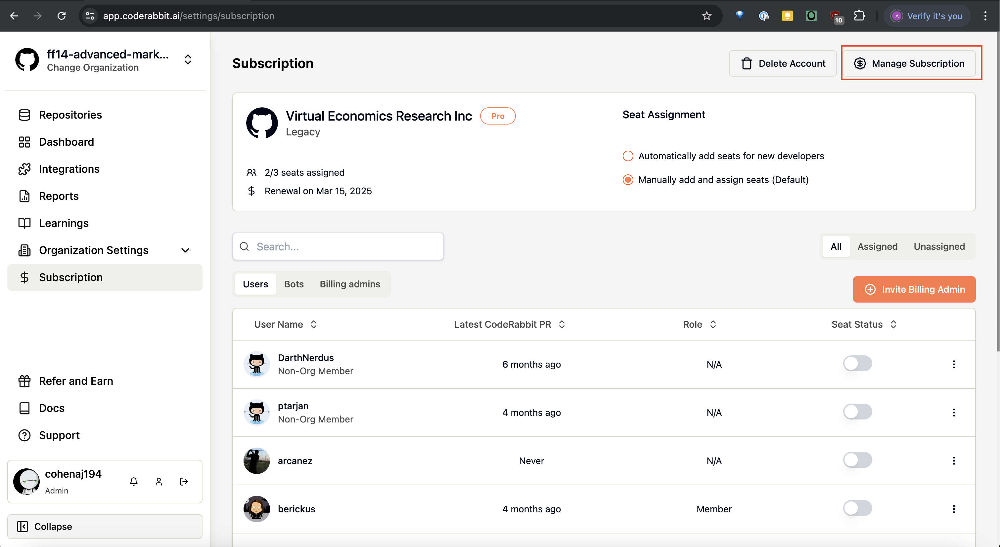
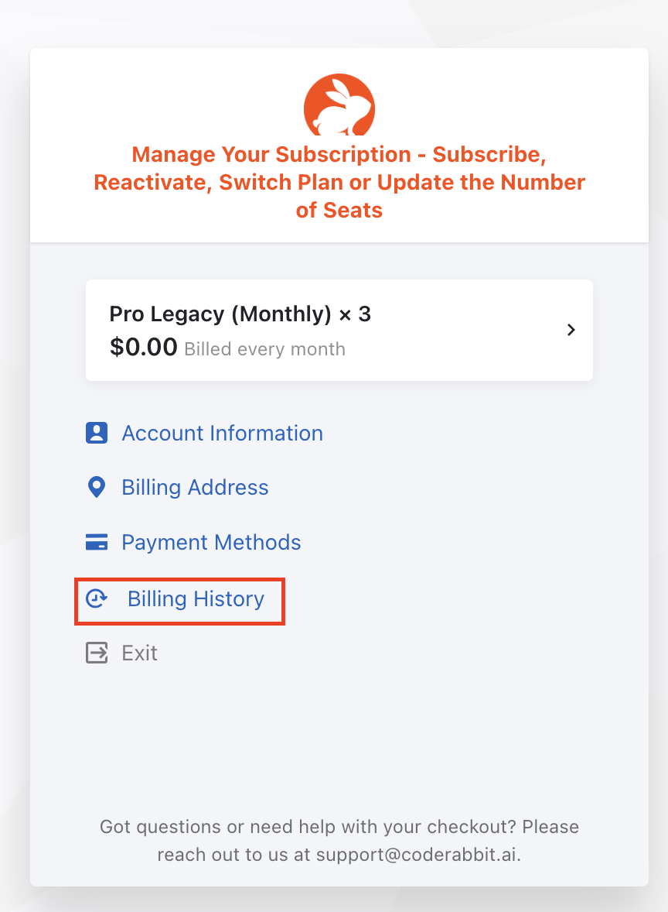
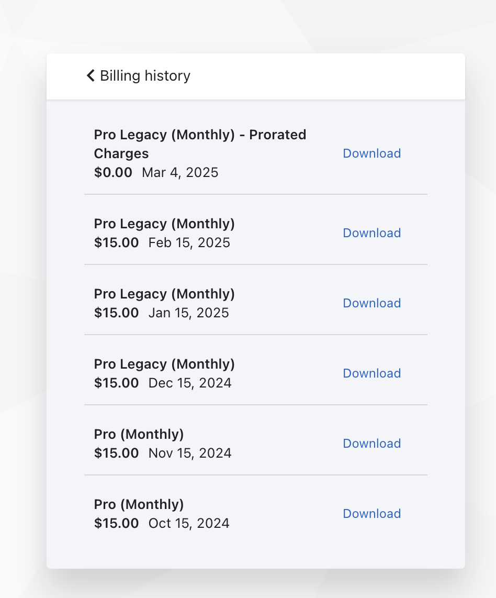
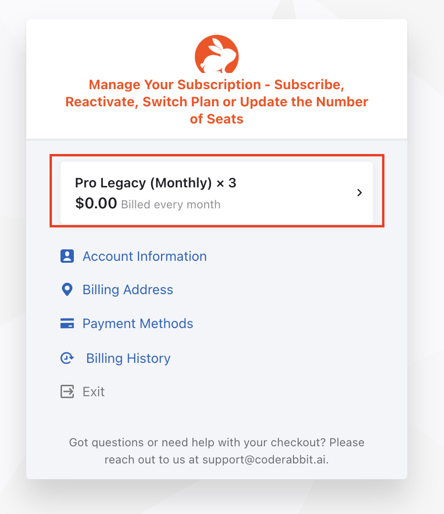
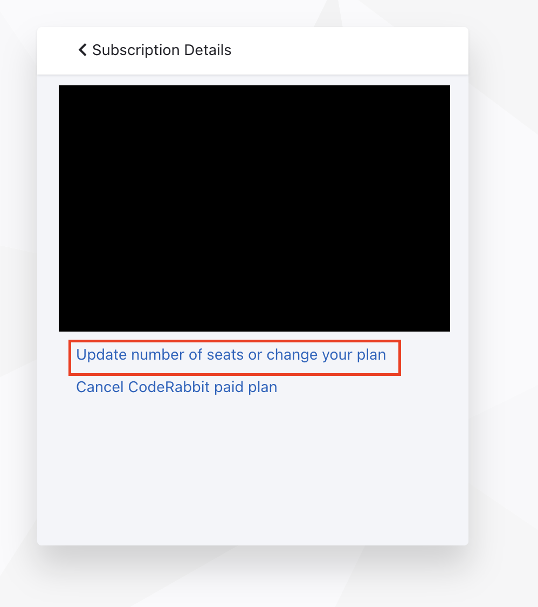
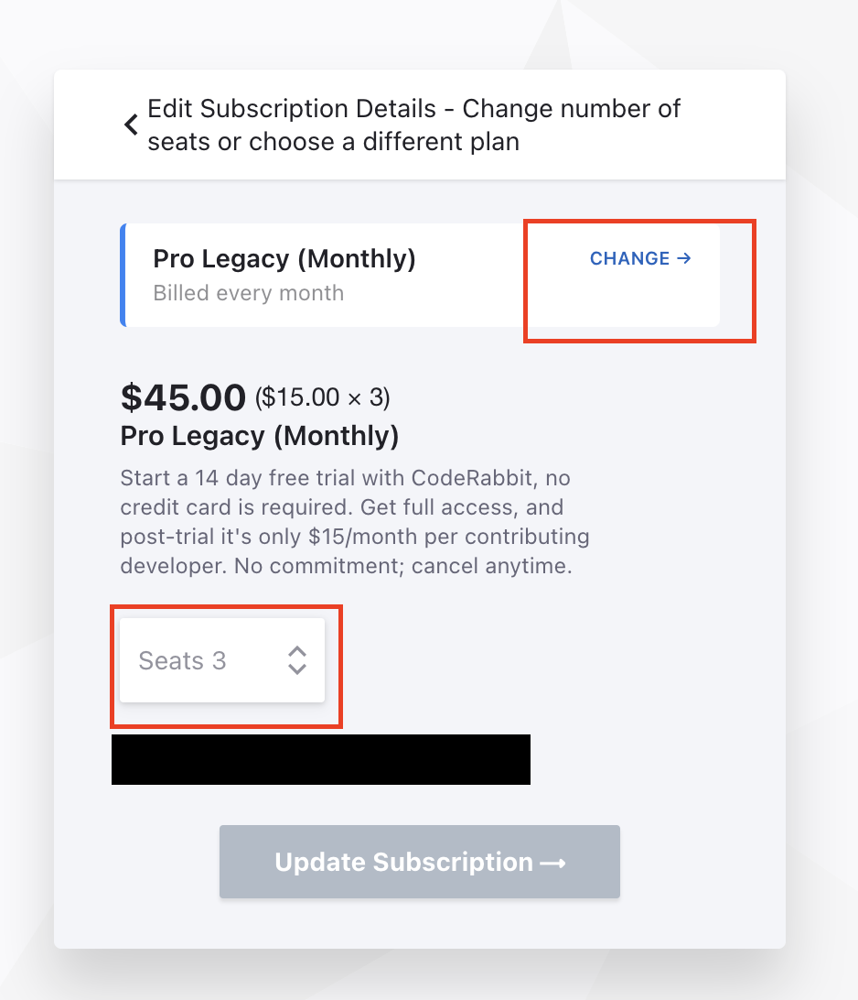
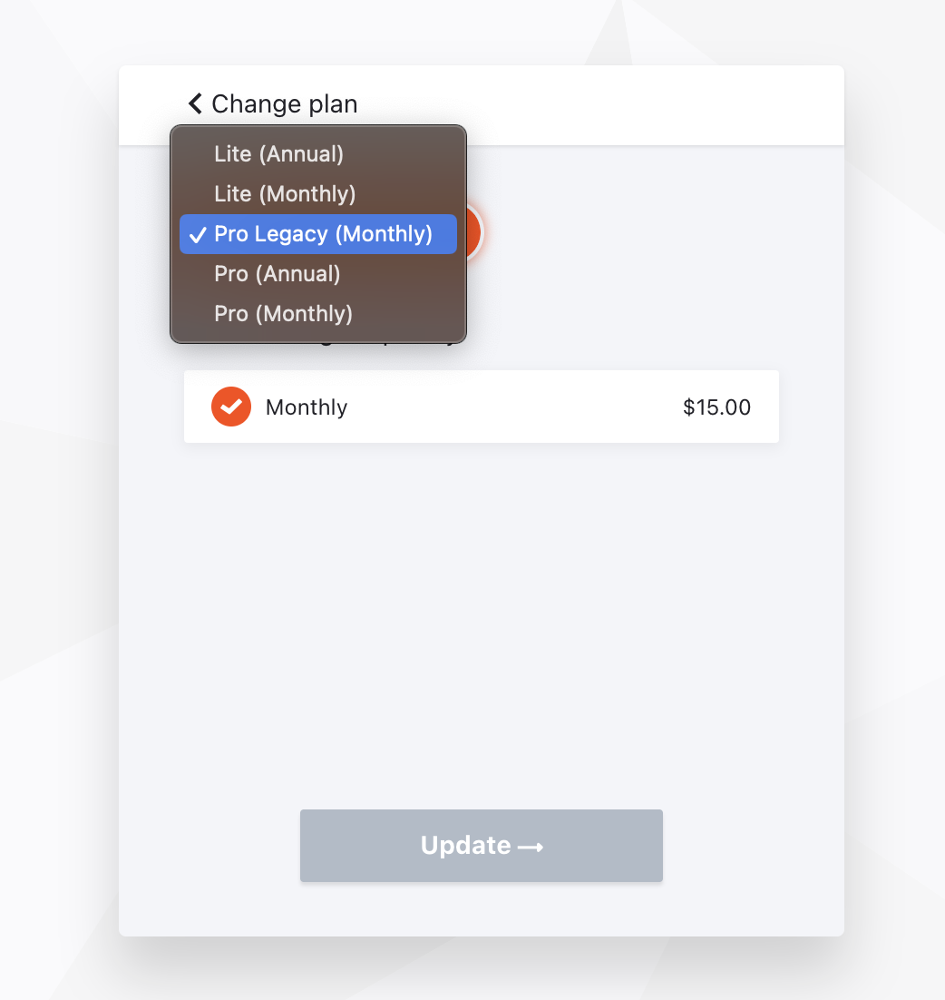

This guide covers how to manage your subscription, including accessing billing information, changing plans, and adjusting your seat count.

## Accessing Billing Information

### Invoices and Payment History

You can access your billing history and download invoices by:

1. Going to [**Subscription**](https://app.coderabbit.ai/settings/subscription) on the sidebar > **Manage Subscription**
2. Once in the customer portal select **Billing History**
3. Click to download an invoice from any specific month of billing

## Managing Your Subscription Plan

### Changing Plans

To upgrade or change your subscription plan:

1. Going to [**Subscription**](https://app.coderabbit.ai/settings/subscription) on the sidebar > **Manage Subscription**
2. Once in the customer portal click the box with your plan highlighted at the top of the page
3. Click **Update number of seats or change your plan**
4. Click **Change** on the section at the top mentioning your current plan
5. Select the new plan you'd like to change to
6. Click **Update**

### Adjusting Seat Count

To modify the number of seats in your subscription:

1. Going to [**Subscription**](https://app.coderabbit.ai/settings/subscription) on the sidebar > **Manage Subscription**
2. Once in the customer portal click the box with your plan highlighted at the top of the page
3. Click **Update number of seats or change your plan**
4. Enter the new number of seats needed
5. Click **Update Subscription**

