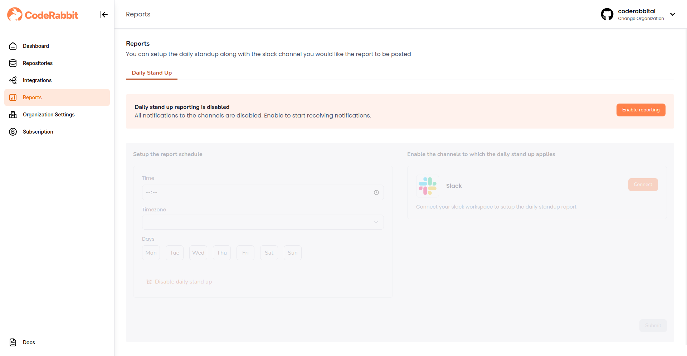
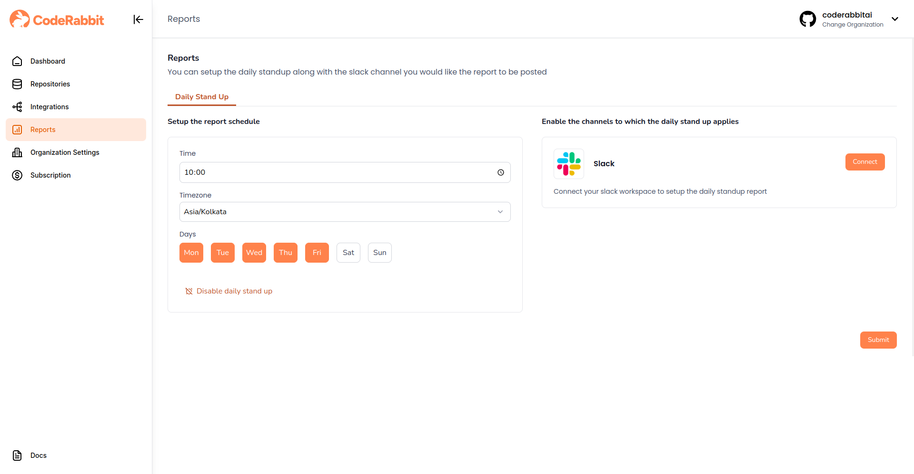
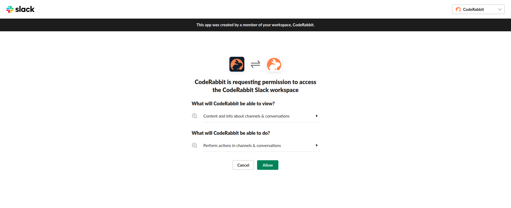
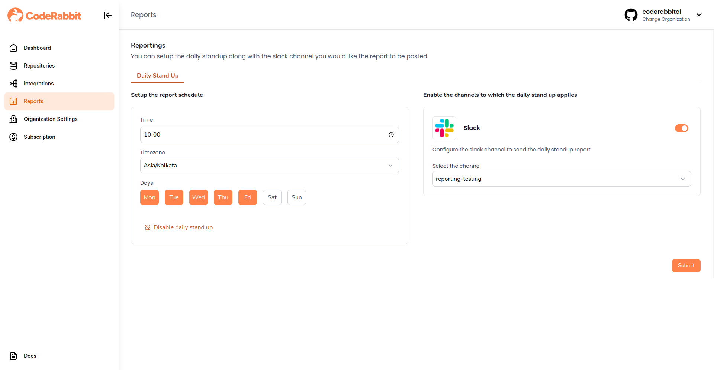
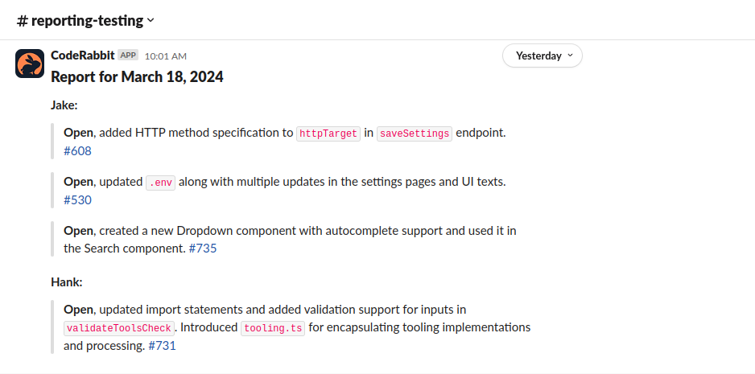

Coderabbit allows you to set up daily standup reports in your slack workspace.
It summarizes the activities of developers based on the pull requests they have made.

Follow the steps below to set up reports:

### **Step 1: Navigate to the Reports page**

Log in to Coderabbit and click on 'Reports' in the sidebar.  
Click on the 'Enable Reporting' button to enable daily standup reporting

### **Step 2: Setup Reporting Schedule**

Select the time, timezone and days as to when you would like the reports to be posted and click on the 'Submit' button to save

:::note

Reports will contain PRs/MRs made by the developers since the last selected day.

For instance, if you schedule the report on Monday and Friday, the report on Monday will have the PRs/MRs that were created since Friday and the report on Friday will have PRs/MRs created since Monday.

If the report is scheduled on all days, every report will have the PRs/MRs made in the last 24 hours

:::

### **Step 3: Connect Slack**

Click on the 'Connect' button to connect your Slack workspace.
You will be redirected to the Slack integration page.
Click on 'Allow' to allow CodeRabbit access to your Slack workspace so that it can post the report

### **Step 4: Select Slack Channel**

Once you're back on the reports page, enable Slack and select the channel where you would like the report to be posted and click on the 'Submit' button to save

You should see the report get posted in the selected Slack channel based on the schedule that was selected

:::info

Reports could take a minute or two to generate.

:::
