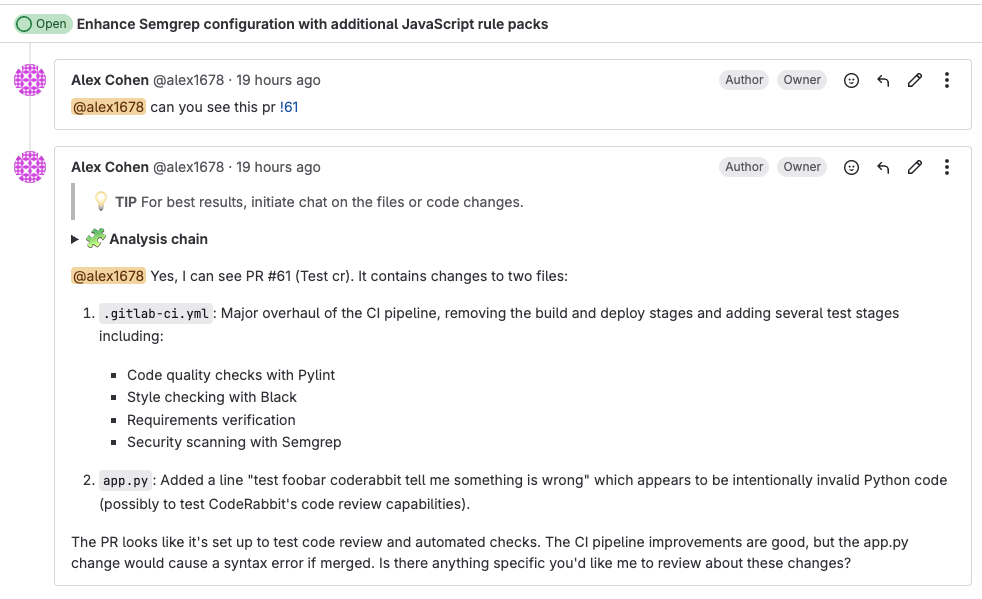
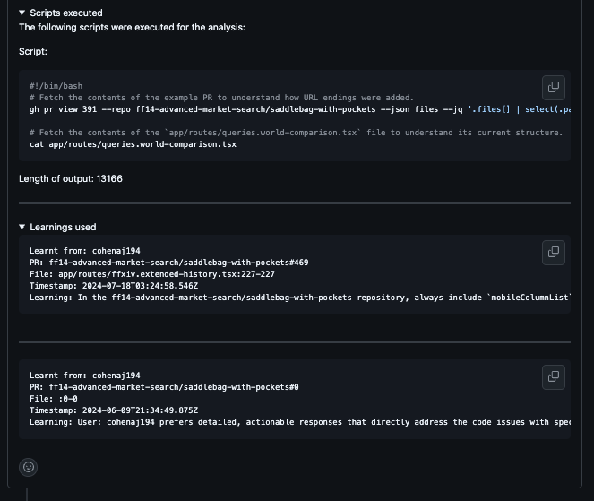
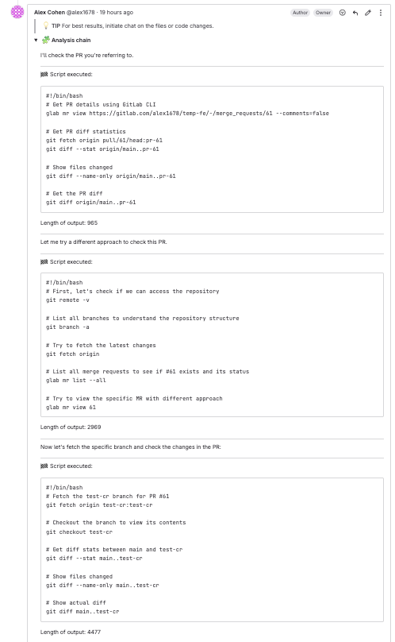

```mdx-code-block
import ProPlanNotice from '@site/src/components/ProPlanNotice.mdx';

<ProPlanNotice />
```

# Issue Chat

CodeRabbit provides an intelligent chat interface directly within GitHub and GitLab issues. This allows developers to have natural conversations about code, get answers to questions, create AI powered code searches, plan features, and gain deeper insights into their codebase - all without leaving their issue tracking workflow.

## Getting Started

To start a conversation with CodeRabbit in any issue:

1. Simply mention `@coderabbitai` (or your custom bot name if configured) in an issue comment
2. Ask your question or make your request in natural language
3. CodeRabbit will analyze the context and respond accordingly

:::note
Organizations can configure a custom bot name by creating their own bot user. The bot will respond to mentions of that custom name instead of `@coderabbitai`.
:::




## Core Capabilities

### Code Analysis

When chatting in issues, CodeRabbit has access to your repository and powerful tools that allow it to analyze and understand your codebase like a real developer. This includes:

- Full access to search and analyze the repository code
- Advanced static analysis capabilities
- Command line tools for code search and manipulation (e.g. grep, awk, sed, etc.)
- Complete git history and metadata information
- Access to past CodeRabbit learnings and insights

This allows CodeRabbit to:

- Search through code to find relevant examples
- Analyze code patterns and relationships
- Generate statistics and metrics
- Provide context-aware answers about the codebase
- Create AI powered code searches
- Use tribal knowledge from learnings to enhance responses




### Agentic Thought Chain

When [agentic thought chain](./agent_chat.md) is enabled, CodeRabbit will use an agentic thought chain to plan out a response using multiple commands in series to articulate a more advanced response.



### Feature Planning Support

Issue chat is particularly valuable during feature planning phases:

- **Code Impact Analysis**: Ask about which parts of the codebase might be affected by proposed changes
- **Pattern Discovery**: Find similar implementations or related code
- **Dependency Mapping**: Understand relationships between components
- **Technical Feasibility**: Get insights into potential challenges or approaches

Example conversation:


## Additional Use Cases

### Open Source Support

CodeRabbit can help maintain open source projects by:

- Answering common support questions
- Providing code examples
- Explaining error messages
- Suggesting debugging steps

Example:

```text
User: @coderabbitai I'm getting "TypeError: Cannot read property 'config' of undefined"

CodeRabbit: Let me help troubleshoot that error...

[Detailed explanation and solution steps]
```

### Documentation Assistance

Use issue chat to:

- Generate API documentation
- Create usage examples
- Update README files
- Write tutorials

Example:

```text
User: @coderabbitai Can you help document the new authentication middleware?

CodeRabbit: I'll analyze the middleware and create documentation...

[Generated documentation with examples]
```

### Marketing Content Generation

CodeRabbit can assist with creating:

- Release announcements
- Blog post drafts
- Social media content
- Community updates

Example:

```text
User: @coderabbitai Help me write a Reddit post about our new GraphQL features

CodeRabbit: I'll create a draft post highlighting the key features...

[Generated Reddit post with technical details and benefits]
```

## Best Practices

1. **Be Specific**
   - Provide context in your questions
   - Mention specific files or features when relevant
   - Clarify your goals or requirements

2. **Iterative Refinement**
   - Start with broad questions
   - Follow up for more details
   - Ask for clarification when needed

3. **Collaborative Planning**
   - Include stakeholders in the conversation
   - Use issue chat to document decisions
   - Reference related issues or PRs

## Related Resources

- [Agentic Chat](./agent_chat.md)
- [Issue Creation](./issue-creation.md)
- [Commands](./commands.md)

Need help? Join our community on [Discord](https://discord.gg/coderabbit) or contact our support team.
