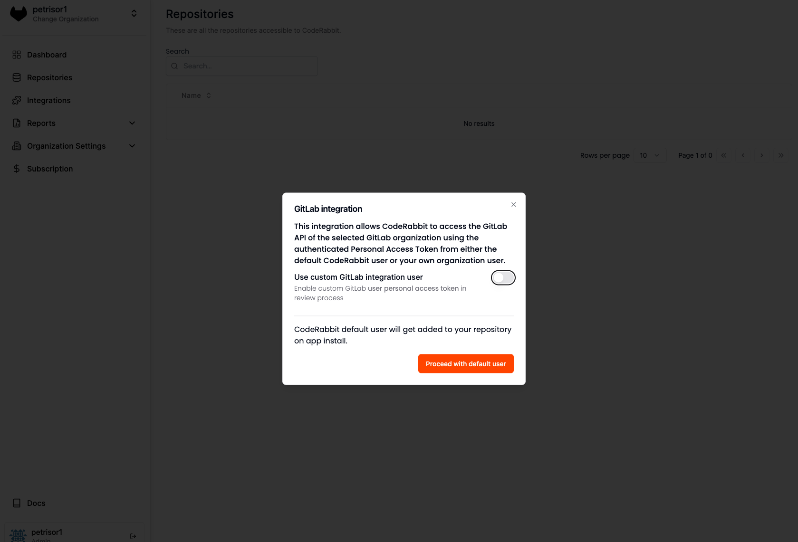
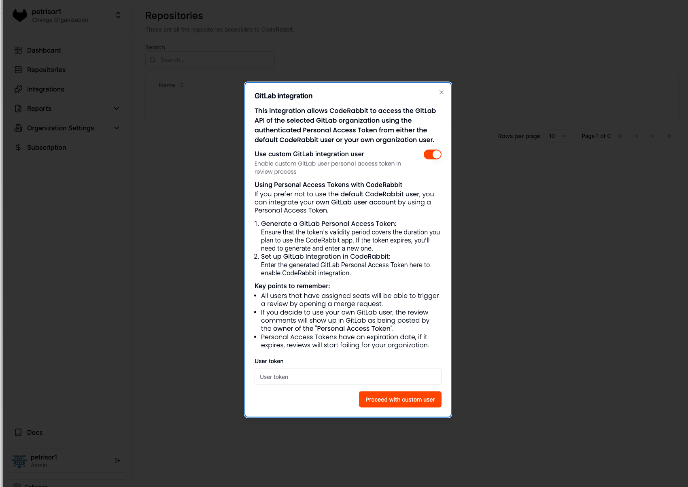

This guide will assist you in effectively integrating CodeRabbit with SaaS GitLab.

## GitLab Access Tokens
To interact with the GitLab API, a **Personal Access Token** is required. This token can either be generated by using our default CodeRabbit user or by creating a **Personal Access Token** from one of your existing users.

Upon first login to the application (immediately after the onboarding screen), you will need to choose based on your organization's requirements.

**We recommend using the default CodeRabbit user** for most organizations as it is pre-configured. However, we understand that some organizations may prefer more control over the user or have restrictions regarding user inclusion within their organization.

### Personal Access Tokens
If your organization opts to use another user within the organization, you can do so by [generating a personal access token](#generating-a-personal-access-token).

#### Recommendations
* **Create a dedicated user for CodeRabbit** - This ensures the user is exclusively for CodeRabbit, allowing better access control.
* **Use "CodeRabbit" as the username** - This makes the user easily recognizable for future reference.
* **Use a dedicated email address** - This helps in easy identification and management.
* **Use the CodeRabbit logo as the profile picture** - This further ensures easy recognition. You can download the logo from [here](https://coderabbit.ai/images/logo.png).

#### Key Points to Remember

* Personal access tokens have expiration dates. Ensure the expiration date covers the duration of your intended use of the CodeRabbit app.
* Code reviews will be attributed to the owner of the personal access token.
* If the personal access token expires, you can add a new one via the CodeRabbit UI:
    * Navigate to the "GitLab User" page in the sidebar.
  * Click the "Update" button on the displayed card to see the same modal as the initial login.

### Generating a Personal Access Token

GitLab provides an option to generate a personal access token for a new user. Follow these steps to generate the token:

1. Log in as the user intended for CodeRabbit reviews.
2. Select your avatar on the left sidebar.
3. Choose "Edit Profile."
4. Select "Access Tokens" from the left sidebar.
5. Click "Add New Token."
6. Enter a name and an expiry date for the token.
7. If no expiry date is entered, it defaults to 365 days from the current date.
8. Ensure the following scopes are selected: `api`, `user`, `email`.
9. Click "Create Personal Access Token."
10. Note down the token as it will only be displayed once.

