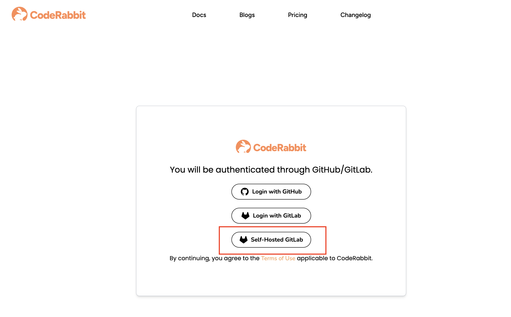
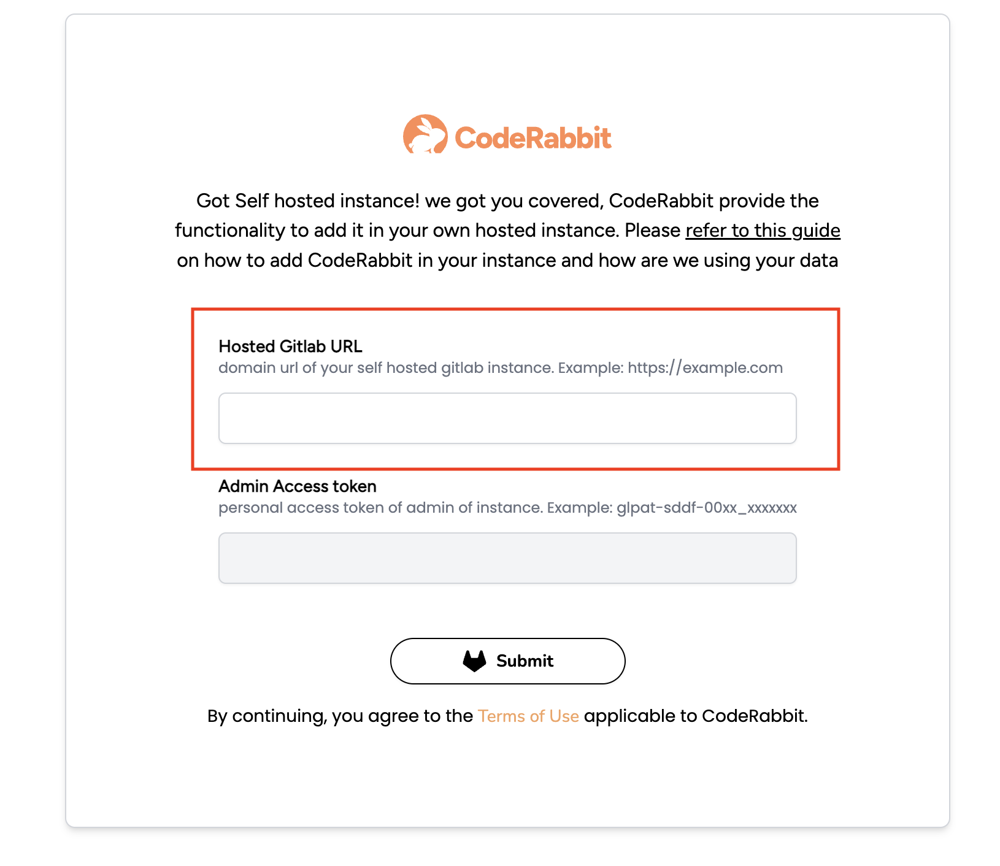
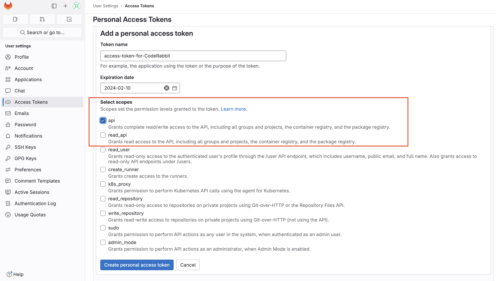
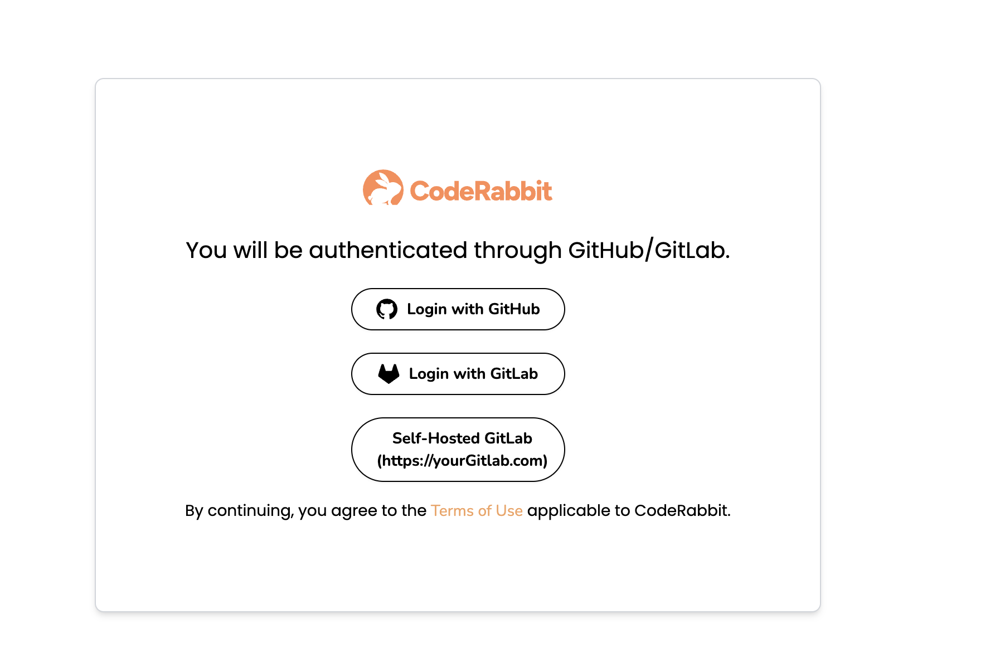

<head>
 <meta charSet="utf-8" />
  <meta name="title" content="CodeRabbit in Self Managed Gitlab" />
  <meta name="description" content="Integrate CodeRabbit in your own hosted Gitlab instance." />

  <meta property="og:type" content="website" />
  <meta property="og:url" content="https://coderabbit.ai/" />
  <meta property="og:title" content="CodeRabbit in Self Managed Gitlab" />
  <meta property="og:description" content="CodeRabbit: AI-powered Code Reviews" />
  <meta property="og:image" content="/preview_meta.jpg" />

  <meta name="twitter:image" content="https://coderabbit.ai/preview_meta.jpg" />
  <meta name="twitter:card" content="summary_large_image" />
  <meta name="twitter:title" content="CodeRabbit in Self Managed Gitlab" />
  <meta name="twitter:description" content="CodeRabbit: AI-powered Code Reviews" />
</head>

This page guides you through the process of integrating your Self-Managed GitLab with CodeRabbit.

To initiate the integration, we require specific information. This is essential for the initial setup of our CodeRabbit user and the creation of the CodeRabbit application within your domain. Once this setup is complete, you can log in directly using the OAuth2 flow.

### **Step 1: Getting Started**

**Visit CodeRabbit:** Land on to our login page https://coderabbit.ai/login and select Self-Hosted Gitlab

### Step 2: Enter your Self Managed Gitlab URL

On this page, you need to enter the URL of your self managed GitLab instance and click submit. Once, you submit, we will check for your organization record in our database.

### **Step 3: Enter Admin Personal Access Token (First time only)**

If this is the first time you are signing up with your instance, then we will need a admin access token for setting up the CodeRabbit bot.

#### **Generating Admin Personal Access token**

GitLab offers an option to generate a personal access token for adding a new user and setting up the application in the self-managed instance. To generate the token, please follow the process outlined below:

1. Login to your self-hosted instance. Ensure sure you have admin rights.
2. On the left sidebar, select your avatar.
3. Select Edit profile.
4. On the left sidebar, select Access Tokens.
5. Select Add new token.
6. Enter a name and expiry date for the token. We need this for the initial setup, so the minimum expiry time is sufficient. 
7. If you do not enter an expiry date, the expiry date is automatically set to 365 days later than the current date.
8. Make sure, you select the scope: `api`
9. Select Create personal access token.
10. Please note down this token as this will be visible one time only

### **Step 3: Paste the token and click submit**

- Once you submit the access token.
- Sit, Relax. We will setup everything
- And next time, when you visit. This will auto detect and you will be able to directly login.

- Furthermore, please refer to our Get Started Guide to make the most of CodeRabbit. [here](../get-started/add-repo.md)
