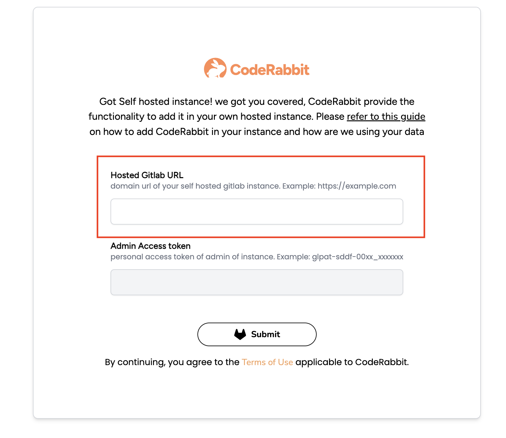

This page guides you through the process of integrating your Self-Managed GitLab
with CodeRabbit.

To initiate the integration, we require specific information. This is essential
for the initial setup of CodeRabbit within your domain. Once this setup is
complete, you can log in directly using the OAuth2 flow.

### 1. Getting Started

**Visit CodeRabbit:** Land on to our [Login](https://coderabbit.ai/login) page
and select Self-Hosted GitLab

### 2. Enter your Self Managed GitLab URL

On this page, enter the URL of your self managed GitLab instance and click
submit. Once, you submit, we check our database for a record of your
organization.

### 3. Enter Admin Personal Access Token (First time only)

If this is the first time you are signing up with your instance, we need an
admin access token for setting up the CodeRabbit.

#### **Generating Admin Personal Access token**

GitLab offers an option to generate a personal access token for adding a new
user and setting up the application in the self-managed instance. To generate
the token, please follow the process outlined below:

1. Login to your self-hosted instance. Ensure sure you have admin rights.
2. On the left sidebar, select your avatar.
3. Select Edit profile.
4. On the left sidebar, select Access Tokens.
5. Select Add new token.
6. Enter a name and expiry date for the token. We need this for the initial
   setup, so the minimum expiry time is sufficient.
7. If you do not enter an expiry date, the expiry date is automatically set to
   365 days later than the current date.
8. Make sure, you select the scope: `api`
9. Select Create personal access token.
10. Please note down this token as this will be visible one time only

### 4. Paste the Token and Submit

- Submit the access token.
- We will handle the setup process for you.

:::note
For future visits, your setup will be automatically recognized, enabling seamless login.
:::

### 5. Whitelist CodeRabbit IP Address

Use this CodeRabbit IP if your instance requires IP whitelisting
`35.222.179.152/32`

:::tip
Refer to our [Get Started Guide](../get-started/add-repo.md) to make the most of CodeRabbit.
:::
