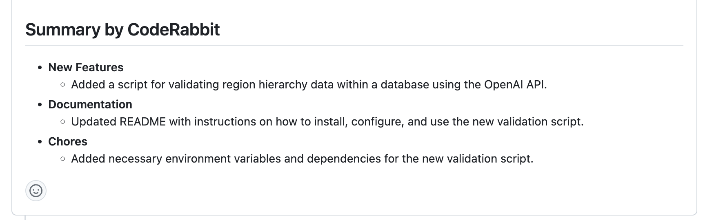
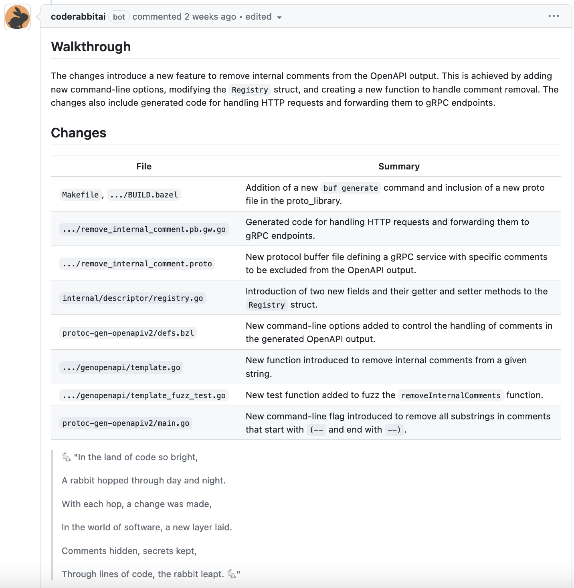
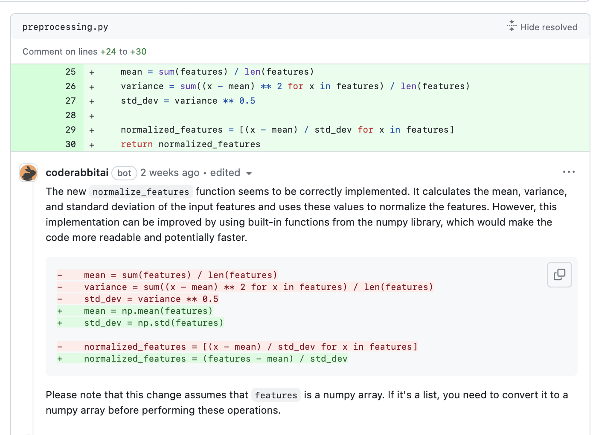
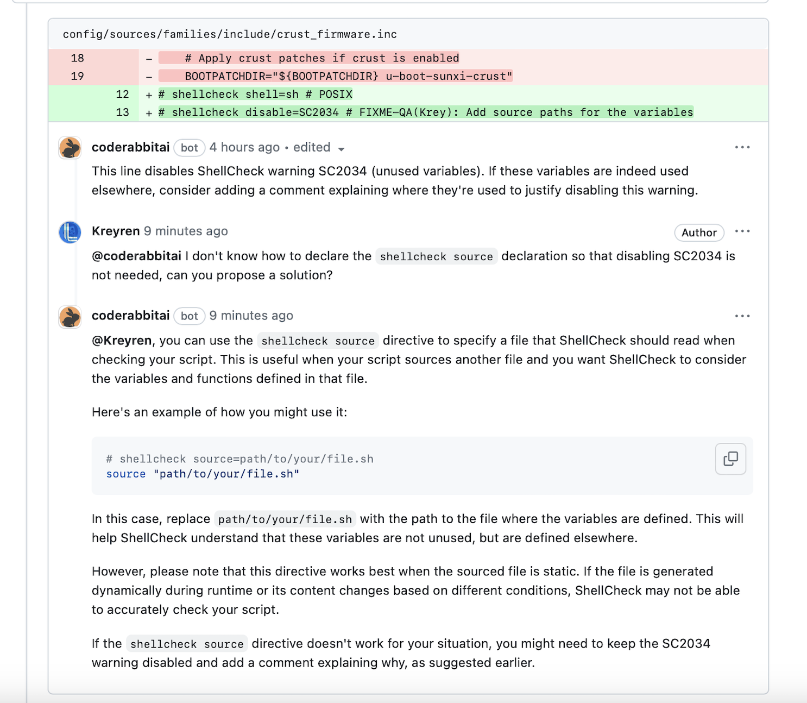
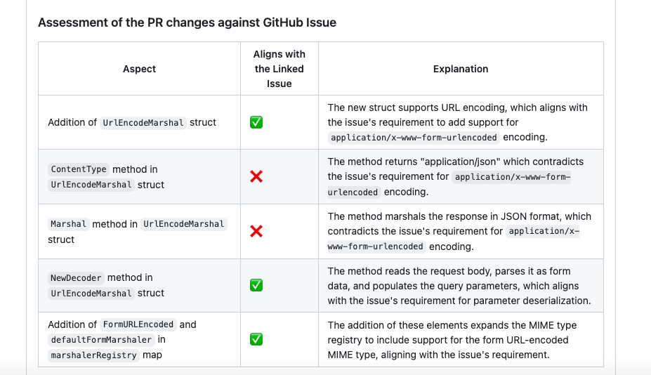
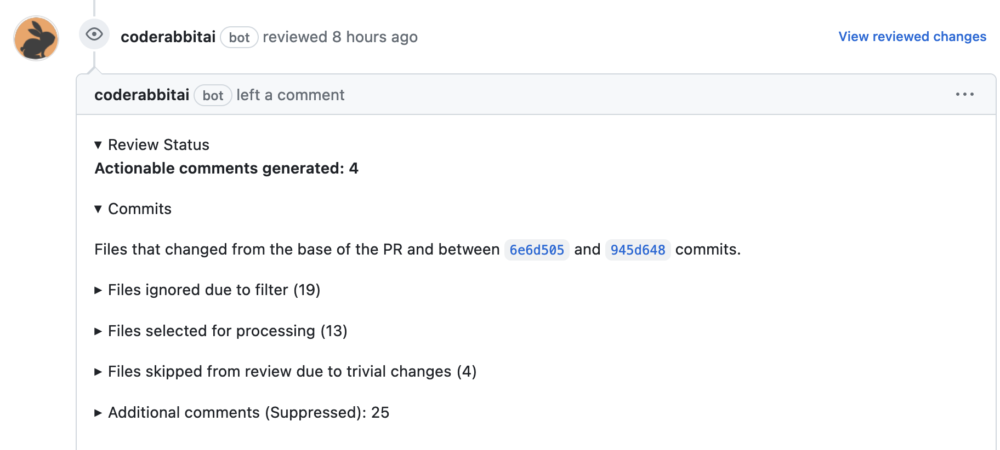

<head>
 <meta charSet="utf-8" />
  <meta name="title" content="CodeRabbit: AI-powered Code Reviews" />
  <meta name="description" content="Accelerate Code Reviews with AI" />

  <meta property="og:type" content="website" />
  <meta property="og:url" content="https://coderabbit.ai/" />
  <meta property="og:title" content="CodeRabbit: AI-powered Code Reviews" />
  <meta property="og:description" content="Accelerate Code Reviews with AI" />
  <meta property="og:image" content="/preview_meta.jpg" />

  <meta name="twitter:image" content="https://coderabbit.ai/preview_meta.jpg" />
  <meta name="twitter:card" content="summary_large_image" />
  <meta name="twitter:title" content="CodeRabbit: AI-powered Code Reviews" />
  <meta name="twitter:description" content="Accelerate Code Reviews with AI" />
</head>

### 1. Pull Request Summary

Generated upon the creation of a pull request and subsequently updated with each incremental request.

High-Level Summary: This offers a concise overview of the changes in the pull request. It helps the team, including those without technical expertise, to quickly understand the changes and the impact on the product.

Walkthrough: A detailed code walkthrough to understand the changes in each file that is part of the pull request, followed by a celebratory poem about the changes.

### 2. Code Review feedback

Review comments: Review feedback posts as pull request review comments on the lines of the code that changed under each file. Any code suggestions are given in a Diff format which either be copied or committed within the pull request with a single click.

### 3. Chat with CodeRabbit

CodeRabbit provides conversational capability that allows developers and the reviewers to ask questions, generate code, and get feedback in the context of changes. Just comment on the CodeRabbit review to start the conversation. CodeRabbit learns from your interactions and gets smarter over time. The more you chat, the better it gets.

### 4. Issue Validation

Pull request changes are validated against the linked GitHub or GitLab issue and identifies all other issues which might be effected by this change.

### 5. Pull Request review status

Review status is generated for each review including a separate one for each incremental commit. Displays the commit IDs that were reviewed, the files examined and ignored, as well as the actionable feedback and additional comments generated for each review.

For information on how to get started with CodeRabbit, visit the [Get Started page](/get-started/signup)
