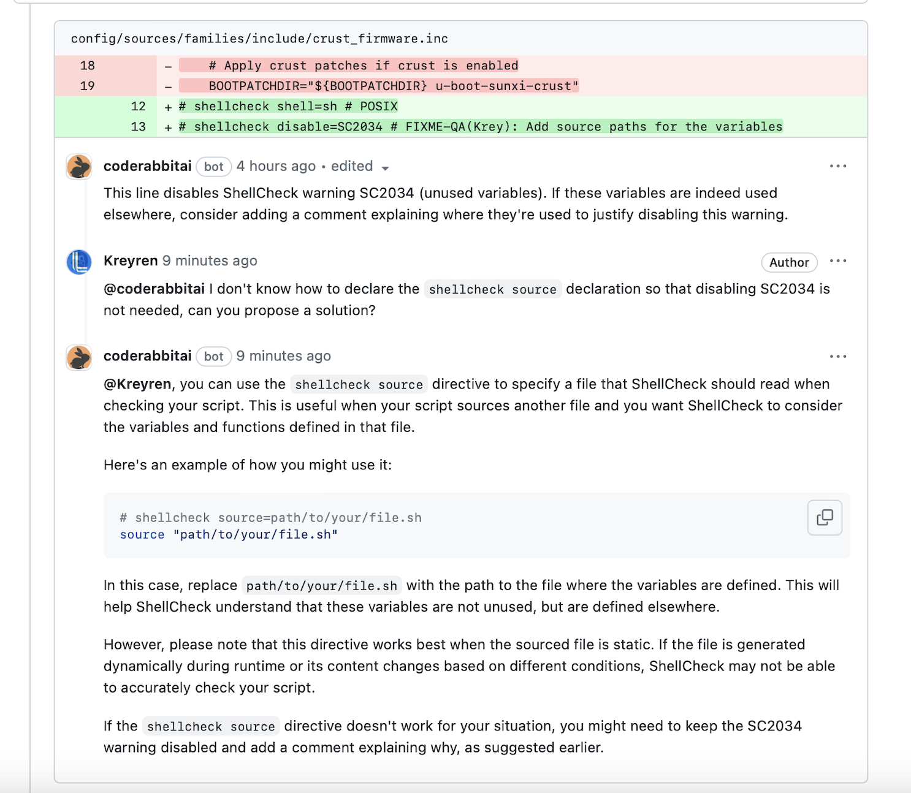

<head>
 <meta charSet="utf-8" />
  <meta name="title" content="CodeRabbit: AI-powered Code Reviews" />
  <meta name="description" content="Accelerate Code Reviews with AI" />

  <meta property="og:type" content="website" />
  <meta property="og:url" content="https://coderabbit.ai/" />
  <meta property="og:title" content="CodeRabbit: AI-powered Code Reviews" />
  <meta property="og:description" content="Accelerate Code Reviews with AI" />
  <meta property="og:image" content="/preview_meta.jpg" />

  <meta name="twitter:image" content="https://coderabbit.ai/preview_meta.jpg" />
  <meta name="twitter:card" content="summary_large_image" />
  <meta name="twitter:title" content="CodeRabbit: AI-powered Code Reviews" />
  <meta name="twitter:description" content="Accelerate Code Reviews with AI" />
</head>

**CodeRabbit** is an innovative, AI-driven platform that revolutionizes the way pull requests are reviewed. It enhances code quality while significantly reducing the time and effort associated with manual code reviews. The platform provides detailed, line-by-line feedback on code changes, offering suggestions for improvements and corrections to enhance code efficiency and robustness. This analysis includes a comprehensive review of logic, syntax, and coding style, along with potential optimizations and corrections.

Moreover, **CodeRabbit** can triage changes and flag pull requests that require more careful scrutiny. Our bot offers conversational capabilities within the context of the code, allowing developers to provide additional context, ask questions, or even generate code. **CodeRabbit** seamlessly integrates with GitHub and GitLab repositories, performing continuous, incremental reviews for each commit within a pull request. Review feedback is sent back to the pull requests and can be directly committed.

## Do you need CodeRabbit with the AI code generators or co-pilot?

Code reviews remain essential, whether the code is written by a human or a bot. This is mainly because the perspective of the reviewer differs from that of the code generator, whether human or machine. This distinction is precisely why human peer reviews have been effective for so long. While AI-powered code-generation tools hold immense potential, it's important to recognize that these generators are still in their early stages and may not be equipped to auto-generate meaningful code for moderately complex applications.

## How does CodeRabbit work?

**CodeRabbit** seamlessly integrates into code repositories using GitHub or GitLab webhooks and monitors events related to Pull Request (PR) and Merge Request (MR) changes. A comprehensive review is performed when a PR or MR is created, and for incremental commits and comments addressed to the bot. The feedback is then sent directly back to the PR or MR.

## Data, Privacy, and Security.

**CodeRabbit** does not utilize data collected during code reviews to train, refine, or influence our models, or any third-party models. The collected data is immediately discarded after the review is complete. We maintain no copies or backups of this review data, and it is purged from our systems without delay. Queries to the Large Language Model (LLM) are ephemeral. Neither we nor the LLM we use share any data collected during the code review process with other third parties.

For information on how to get started with **CodeRabbit**, please visit the [Get Started page](/get-started/signup).
